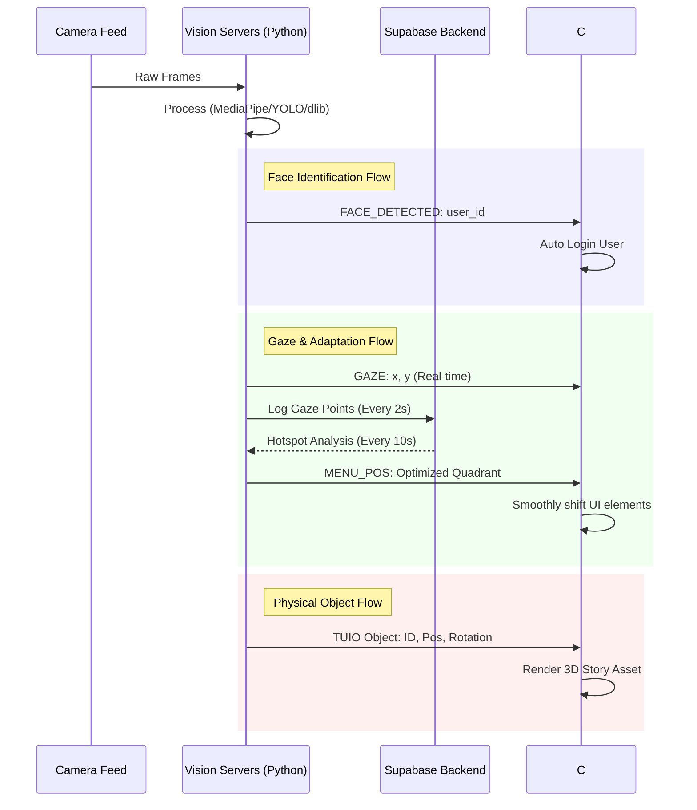
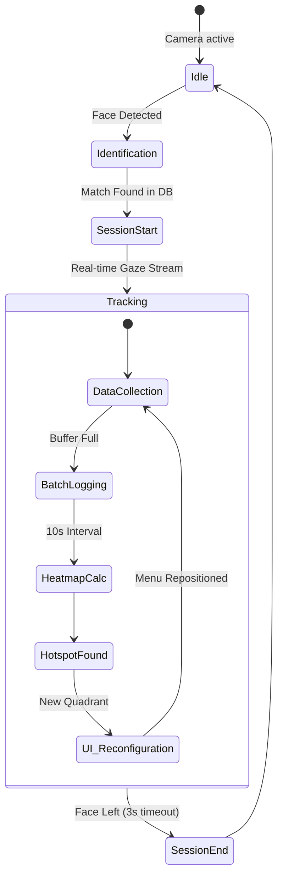
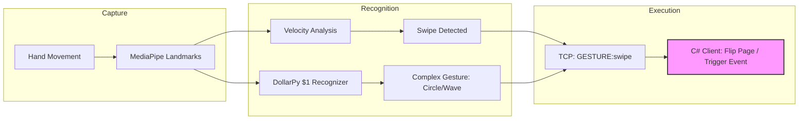
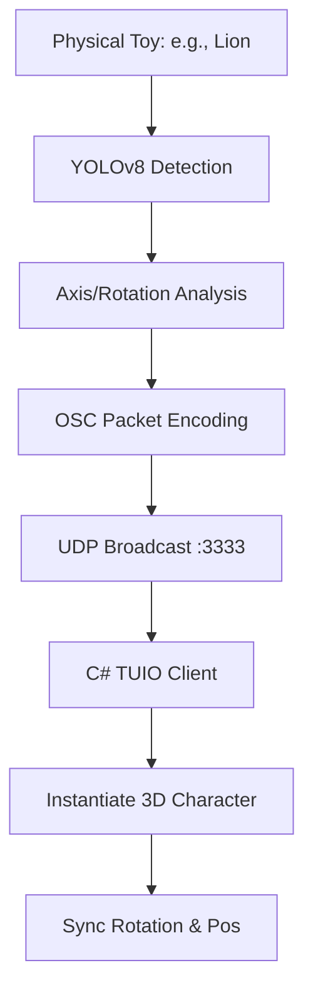

# Story Builder - Detailed Workflows

This document visualizes the dynamic interactions and data pipelines within the Story Builder ecosystem.

## 1. System-Wide Data Flow
This diagram shows how data originates from the hardware and propagates through the vision processing layers to the final UI adaptation.

---

## 2. User Adaptive Lifecycle
This workflow details how the system "learns" from the user's focus and adapts the interface.

---

## 3. Gesture & Command Pipeline
How air gestures are converted into story progression.

---

## 4. TUIO Object Integration
The physical-to-digital pipeline for story props.

