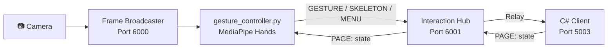

# 🎮 MediaPipe Hand Gesture Controller — Full Game Walkthrough

## Architecture



> [!IMPORTANT]
> The new `gesture_controller.py` replaces the old standalone `gesture_server.py` (port 5001). It follows the same distributed pattern as the gaze worker — connecting to the Frame Broadcaster for frames and the Hub for message relay.

---

## How to Run

### Step 1: Start All Servers
```powershell
cd d:\story-builder
python run_all_servers.py
```

### Step 2: Or Run Individually (for debugging)
```powershell
# Terminal 1 — Hub
python server.py

# Terminal 2 — Frame Broadcaster
python main.py

# Terminal 3 — Gesture Controller
python gesture_controller.py

# Terminal 4 — Launch C# Client
```

---

## 🖐️ Full Gesture Map — Playing the Game Hand-Free

### Screen 1: Sign In

| Gesture | Hold Time | Action |
|---------|-----------|--------|
| ✋ Open Palm (right hand) | 1.5s | Login as Guest |
| ✌️ Peace Sign (right hand) | 1.5s | Navigate to Sign Up |

**Visual feedback:** A green progress bar fills on screen while holding the gesture.

### Screen 2: Sign Up

| Gesture | Action |
|---------|--------|
| ✊ Fist (hold 0.6s) | Confirm / Submit name |
| 🖐️ Open Palm (right) | Cancel → back to Sign In |

> [!NOTE]
> Letter entry still uses TUIO markers (0-25). The gesture controller supplements the existing marker-based name entry.

### Screen 3: Story Selection

| Gesture | Action |
|---------|--------|
| ☝️ Point / Open Hand | Move cursor over story cards |
| 👉 Swipe Right | Highlight next story |
| 👈 Swipe Left | Highlight previous story |
| ✊ Fist Click (hold 0.6s) | Select the hovered story |
| 🖐️ Left Palm (hold) | Open circular menu |
| 👍 Thumbs Up | Go back to Sign In |

### Screen 4: Story Player

| Gesture | Action |
|---------|--------|
| 👉 Swipe Right | Next scene |
| 👈 Swipe Left | Previous scene |
| 👆 Swipe Up | Skip dialogue forward |
| ✊ Fist Click | Advance dialogue / Click |
| 🤟 Wave, Circle, Push | Complete challenge |
| 🖐️ Left Palm (hold) | Open circular menu |
| 👍 Thumbs Up | Back to Story Selection |

### Circular Menu (Any Screen)

| Gesture | Action |
|---------|--------|
| 🖐️ Left Open Palm (hold ~0.5s) | **Open** menu |
| ☝️ Right hand cursor | **Hover** over items |
| ✊ Right fist (hold 0.6s) | **Select** hovered item |
| Drop left hand | **Close** menu |

---

## Step-by-Step: Playing a Complete Game Session

````carousel
### Step 1 — Start
Launch all servers + C# client. Stand in front of camera (~1-2m away). The gesture controller window shows your hands with landmark overlays.

**You'll see:** `Page: SignIn` on the controller preview.
<!-- slide -->
### Step 2 — Login
Hold your **right hand open palm** ✋ for 1.5 seconds. A progress bar fills up, then you're logged in as a Guest.

**Alternative:** Hold **peace sign** ✌️ for 1.5s to go to Sign Up instead.
<!-- slide -->
### Step 3 — Select a Story
You're on the Story Selection screen. **Point** ☝️ with your index finger to move the cursor. **Swipe right/left** to browse stories. Make a **fist** ✊ for 0.6s to select.

**Or:** Hold left palm to open circular menu and select directly.
<!-- slide -->
### Step 4 — Play the Story
Use **swipe right** 👉 to go to the next scene. **Swipe up** 👆 to skip dialogue. When a **challenge** appears, perform a **wave**, **circle**, or **fist click** to complete it.
<!-- slide -->
### Step 5 — Navigate Back
Show **thumbs up** 👍 to go back to Story Selection. From Story Selection, thumbs up again returns to Sign In.
````

---

## Messages Sent to C# Client

| Message | Format | When |
|---------|--------|------|
| `GESTURE:<name>` | `swipe_right`, `swipe_left`, `swipe_up`, `swipe_down`, `click`, `palm_login`, `peace_signup`, `thumbs_up` | Gesture recognized |
| `HAND_CURSOR:<x>,<y>` | Normalized 0-1 coordinates | Every processed frame |
| `HAND_STATE:<state>` | `open`, `fist`, `point`, `peace`, `thumbs_up`, `unknown` | Every processed frame |
| `SKELETON:{rw:[x y],...}` | Same format as old gesture server | Every 4th frame |
| `MENU_SHOW` | — | Left palm held |
| `MENU_HIDE` | — | Left palm dropped |
| `MENU_HOVER:<idx>:<name>` | `0:Story 1` | Cursor over menu item |
| `MENU_SELECT:<idx>:<name>` | `2:Story 3` | Fist click on menu item |

---

## Files Modified/Created

| File | Change |
|------|--------|
| [gesture_controller.py](file:///d:/story-builder/gesture_controller.py) | **NEW** — Full MediaPipe Hands game controller |
| [TuioDemo.cs](file:///d:/story-builder/Client/Client/TUIO11_NET-master/TuioDemo.cs) | Added `HAND_CURSOR`, `HAND_STATE`, `palm_login`, `peace_signup`, `thumbs_up`, `swipe_up` handlers |
| [run_all_servers.py](file:///d:/story-builder/run_all_servers.py) | Added Gesture Controller to server list |

> [!TIP]
> The old `gesture_server.py` still works standalone on port 5001 if you need it as a fallback. The new `gesture_controller.py` goes through the Hub on port 6001→5003.
